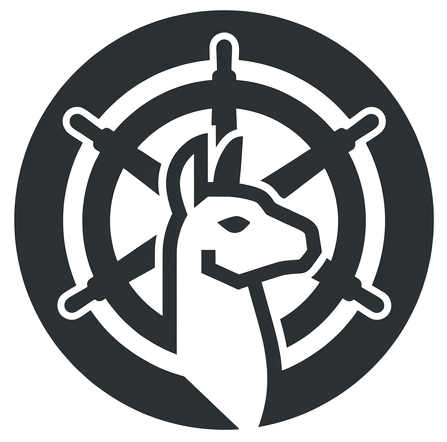
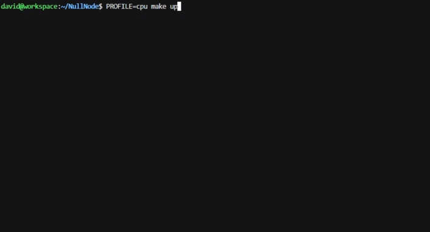
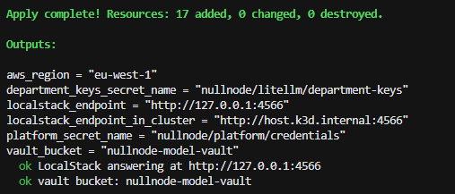
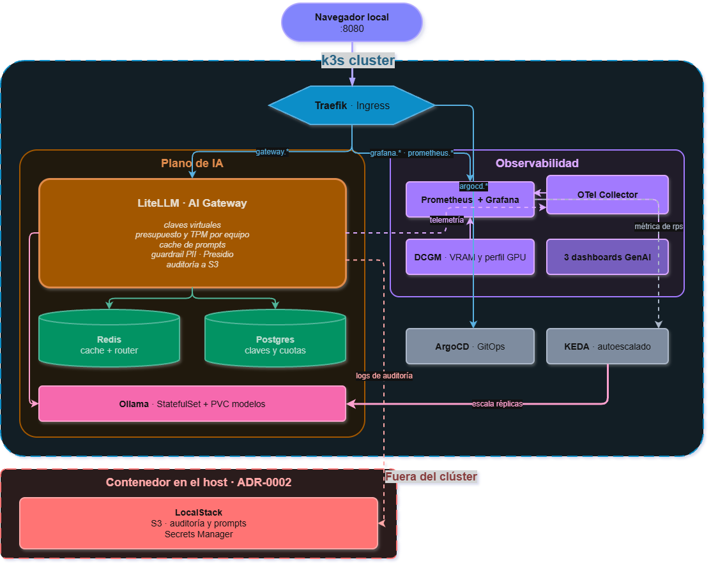
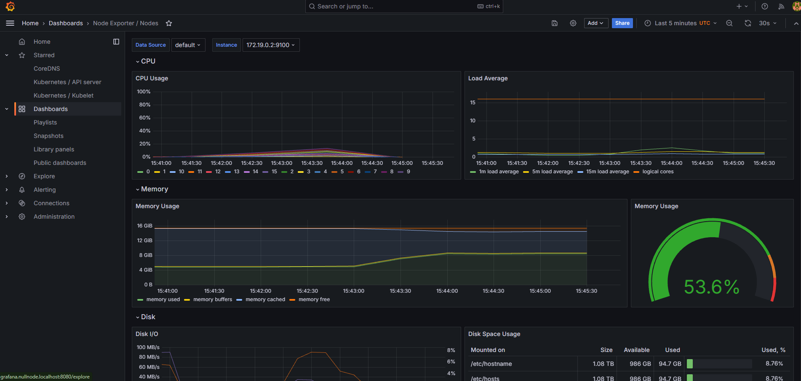
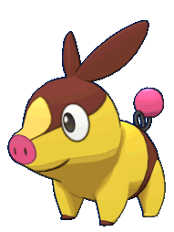

# NullNode 

Plataforma LLMOps enterprise local y privada sobre K3s. Implementa inferencia local de LLMs con escalado dinámico (KEDA), gateway con presupuestos y control de costes (LiteLLM), caché de prompts (Redis), observabilidad dedicada GenAI y despliegue automatizado 100% por GitOps con ArgoCD y Terraform.

Coste: 0 € (solo luz). Todo corre en tu hardware y los servicios de AWS están mockeados.

```bash
make up          # perfil GPU (por defecto)
PROFILE=cpu make up
make status
make smoke
```

<!-- despliegue en consola, `make up` de principio a fin -->
<p align="center">
  
</p>

Todo mockeado: AWS, S3, Bedrock, etc.
<p align="center">
  
</p>
---

## Antes de arrancar

### 1. Por defecto asume GPU NVIDIA

Necesitas: driver NVIDIA en el host (en Windows si usas WSL2, no en la distro),
`nvidia-container-toolkit` dentro de la distro con Docker reiniciado, la imagen
`make k3s-cuda-image` (una vez, los nodos de k3d son contenedores y la oficial
no trae el runtime), y el device plugin, que se instala solo con el perfil GPU.
El preflight de `make up` te dice cuál falta.

**Sin GPU:** `PROFILE=cpu make up`. Todo igual, solo más lento por respuesta.

### 2. Con una sola GPU no escales réplicas

El device plugin asigna la tarjeta en exclusiva, así que la segunda réplica se
queda `Pending`. La concurrencia se consigue con `OLLAMA_NUM_PARALLEL`. En
perfil CPU sí escala. Ver [ADR-0004](docs/adr/0004-scaling-signal.md).

### 3. Se reconcilia desde git, no desde tu copia local

Editar un fichero no hace nada hasta que lo pusheas a la revisión que ArgoCD
sigue. Para iterar sobre una rama:

```bash
terraform -chdir=infra/terraform/platform-bootstrap apply \
  -var gitops_target_revision=mi-rama
```

### 4. El primer arranque tarda 10-20 minutos

Se descargan la pila de observabilidad y los pesos de los modelos. `^C` es
seguro: ArgoCD sigue reconciliando por dentro.

### 5. No hay UI de chat

`make up` expone un endpoint compatible con OpenAI. Conéctate desde VS Code
con Continue o Cline: [docs/uso/CONECTAR.md](docs/uso/CONECTAR.md).

### 6. Versiones pinneadas sin verificar en red

Los charts de terceros están fijados a ciegas: pasa `make versions-check`
antes del primer despliegue. Las métricas de LiteLLM dependen de la versión
pinneada, y afectan a dashboards y al trigger de KEDA
([ADR-0006](docs/adr/0006-metrics-sources.md)).

---

## Arquitectura

<!-- diagrama de arquitectura (queda diseñarla) -->
<p align="center">
  
</p>

Una petición: entra por Traefik → LiteLLM valida la clave del departamento y su
presupuesto → consulta la caché en Redis → si es miss, enruta a Ollama →
registra gasto en Postgres, traza en el collector, métrica en Prometheus y la
petición completa en S3.

| Capa | Componente | Qué hace |
| --- | --- | --- |
| Gateway | LiteLLM | Endpoint compatible con OpenAI. Claves virtuales por departamento con presupuesto, TPM y RPM. Caché, guardrail de PII, auditoría. |
| Caché | Redis | Caché de prompts y estado compartido del router. |
| Gobierno | PostgreSQL | Equipos, claves y presupuestos. Sobreviven a un reinicio y se cambian por API. |
| Inferencia | Ollama | StatefulSet con caché de modelos por réplica y precarga de pesos. |
| Escalado | KEDA | Escala según peticiones por segundo, no según CPU. |
| Observabilidad | Prometheus, Grafana, OTel, DCGM | TTFT, tokens/s, hit rate, gasto por equipo, VRAM. |
| Guardrails | Presidio | Detección y enmascarado de PII. Opcional. |
| Cloud mock | LocalStack | S3 y Secrets Manager. De aquí salen los secretos. |
| GitOps | ArgoCD | App-of-apps con sync waves, un solo Application raíz. |
| IaC | Terraform, k3d | Dos stacks: cloud mockeado y bootstrap de la plataforma. |

<br>
<p align="center">
  
</p>

## Requisitos

Docker, `k3d` ≥ 5.6, `kubectl`, `Helm` ≥ 3.14, `Terraform` ≥ 1.6. El preflight
de `make up` los comprueba y enlaza la instalación de lo que falte.

También `make`, en una WSL2 recién instalada no lo trae🤓:
`sudo apt install make`. O usa `scripts/` directamente si pasas de instalaciones extra:

| `make` | equivalente |
| --- | --- |
| `make up` | `./scripts/up.sh` |
| `make down` | `./scripts/down.sh` |
| `make status` | `./scripts/status.sh` |
| `make smoke` | `./scripts/smoke.sh` |
| `make validate` | `./scripts/validate.sh` |
| `make security` | `./scripts/security.sh` |
| `PROFILE=cpu make up` | `PROFILE=cpu ./scripts/up.sh` |

16 GiB de RAM y ~60 GiB de disco en perfil GPU; 8 GiB de RAM en CPU.

## Posibles mejoras

A futuro lo que tiene sentido añadir sin cambiar la arquitectura base:

- GPUs no-NVIDIA. Solo cambiaría la imagen de k3s y el device plugin (ROCm en
  AMD, GGML en Apple Silicon); el resto de la plataforma no se toca.
- Un proveedor hosted en el catálogo, para que el FinOps deje de ser un
  ensayo y los presupuestos por departamento controlen dinero real.
- External Secrets Operator, para sincronizar Secrets desde Secrets Manager
  con rotación, sin pasar por `terraform apply`.
- Open WebUI como componente opcional dentro del app-of-apps, en vez del
  `docker run` suelto de ahora.
- Tempo como backend de trazas, ya que el collector recibe OTLP de LiteLLM;
  con su datasource en Grafana se podría ver dónde se va el tiempo en una
  petición lenta.
- Un namespace por departamento con `ResourceQuota`, para que las cuotas
  dejen de ser solo lógicas en el gateway.

## Documentación

[docs/](docs/) — arquitectura, decisiones, runbook, guía de conexión para devs.

---

<p align="center">
  
  
</p>

<p align="center">DavidNull 🐰</p>
