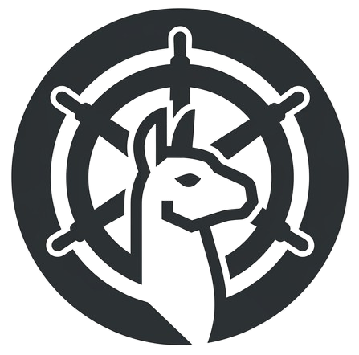
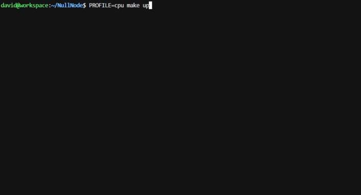
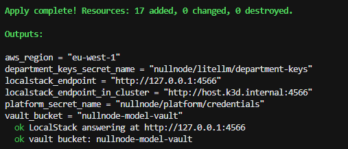
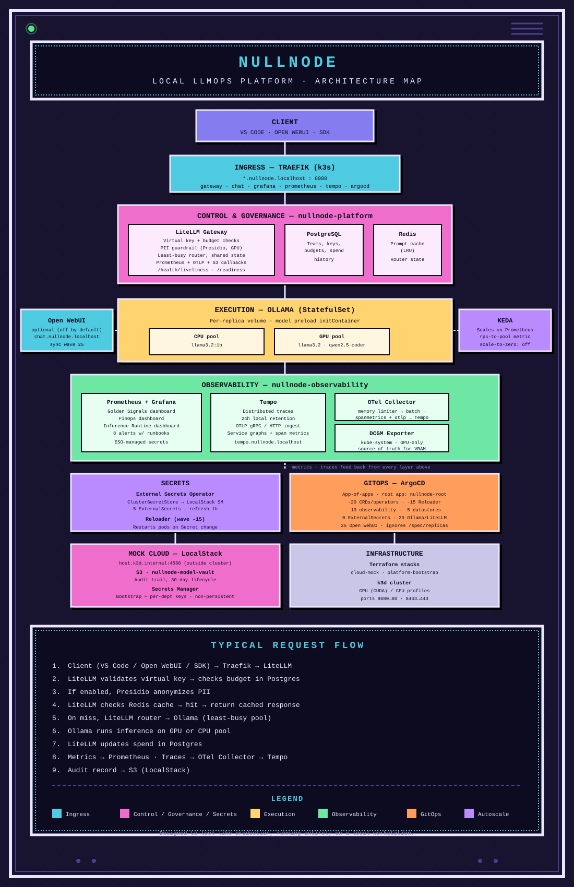
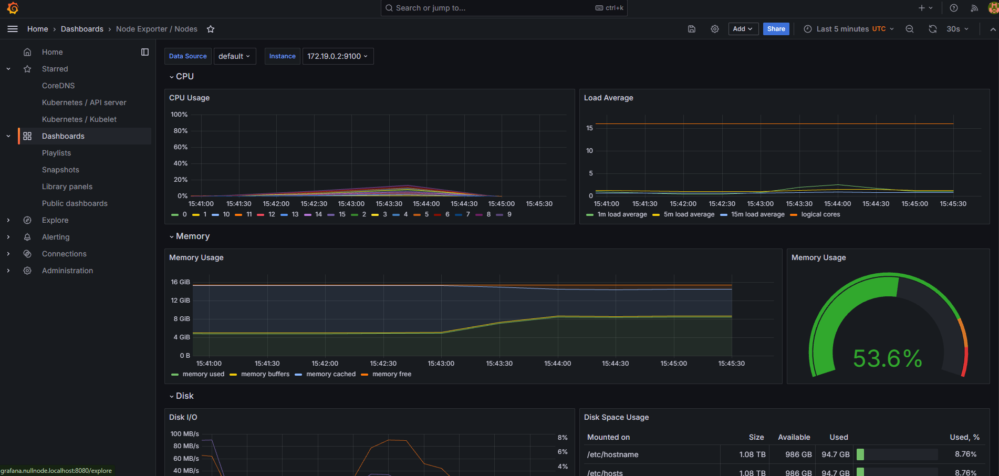

# NullNode 

**Everything a real platform has, but on your own hardware.**

<p align="center">
  
  
  
  
  
  
  
  
  
  
  
  
  
  
  
  
  
  
</p>

The idea came from something pretty specific: a group of people at home who want their own lightweight AI (because with home resources you can't do much more), without paying a cent, and with real control over who spends what and when. Governance, basically.

Local and private enterprise LLMOps platform on K3s. Implements local LLM inference with dynamic scaling (KEDA), gateway with budgets and cost control (LiteLLM), prompt cache (Redis), dedicated GenAI observability, and 100% automated GitOps deployment with ArgoCD and Terraform.

Cost: 0€ (just electricity). Everything runs on your hardware and AWS services are mocked.

```bash
make up          # GPU profile (default)
PROFILE=cpu make up
make status
make smoke
```

<!-- console deployment, `make up` from start to finish -->
<p align="center">
  
</p>

Everything mocked: AWS, S3, Bedrock, etc.
<p align="center">
  
</p>

---

## Architecture

<p align="center">
  
</p>

The diagram shows the full stack: Ingress (Traefik), Control & Governance (LiteLLM, PostgreSQL, Redis), Execution (Ollama, Presidio), Observability (Prometheus, Grafana, Tempo, OTel), Secrets (External Secrets Operator, Reloader), GitOps (ArgoCD), Mock Cloud (LocalStack), and Infrastructure (Terraform, k3d).

### Typical Request Flow

Client → Traefik → LiteLLM (validates key + budget, checks cache) → Ollama (inference) → back through LiteLLM → updates Postgres, sends metrics/traces/audit.

## Before you start

### 1. Defaults to NVIDIA GPU

You need: NVIDIA driver on the host (on Windows if you use WSL2, not in the distro),
`nvidia-container-toolkit` inside the distro with Docker restarted, the
`make k3s-cuda-image` image (once, k3d nodes are containers and the official one
doesn't bring the runtime), and the device plugin, which installs automatically
with the GPU profile. The `make up` preflight tells you what's missing.

**No GPU:** `PROFILE=cpu make up`. Same thing, just slower responses.

### 2. With a single GPU don't scale replicas

The device plugin assigns the card exclusively, so the second replica stays
`Pending`. Concurrency is achieved with `OLLAMA_NUM_PARALLEL`. CPU profile
does scale. See [ADR-0004](docs/adr/0004-scaling-signal.md).

### 3. Reconciles from git, not from your local copy

Editing a file does nothing until you push it to the revision ArgoCD follows.
To iterate on a branch:

```bash
terraform -chdir=infra/terraform/platform-bootstrap apply \
  -var gitops_target_revision=my-branch
```

### 4. First boot takes 10-20 minutes

The observability stack and model weights get downloaded. `^C` is safe:
ArgoCD keeps reconciling in the background.

### 5. No chat UI

`make up` exposes an OpenAI-compatible endpoint. Connect from VS Code with
Continue or Cline: [docs/usage/CONNECT.md](docs/usage/CONNECT.md).

### 6. Pinned versions without network verification

Third-party charts are pinned blindly: run `make versions-check` before the
first deployment. LiteLLM metrics depend on the pinned version and affect
dashboards and the KEDA trigger ([ADR-0006](docs/adr/0006-metrics-sources.md)).

---

## Architecture

<p align="center">
  
</p>

The platform is organized in layers:

### Ingress Layer
- **Traefik** (comes with k3s): Single entry point on port 8080
  - Routes by host: `gateway.nullnode.localhost`, `chat.nullnode.localhost`, `grafana.nullnode.localhost`, etc.

### Control & Governance Layer
- **LiteLLM Gateway**: OpenAI-compatible endpoint with department keys, budgets, rate limits, PII guardrail, cache integration
- **PostgreSQL**: Stores teams, virtual keys, budgets and spend history
- **Redis**: Prompt cache and shared router state

### Execution Layer
- **Ollama**: StatefulSet with per-replica model cache and weight preloading
- **Presidio**: PII detection and masking (GPU profile)

### Observability Layer
- **Prometheus + Grafana**: Metrics, dashboards (Golden Signals, FinOps, Inference Runtime, Traces)
- **Tempo**: Distributed tracing backend with query UI
- **OpenTelemetry Collector**: Receives traces, derives RED metrics as fallback
- **DCGM Exporter**: VRAM metrics (GPU profile)

### Secrets Layer
- **External Secrets Operator**: Syncs credentials from LocalStack Secrets Manager to Kubernetes Secrets
- **Reloader**: Restarts pods when secrets change (automatic rotation)

### GitOps Layer
- **ArgoCD**: App-of-apps with sync waves, single root Application, multi-source `$values` pattern

### Mock Cloud Layer
- **LocalStack**: S3 (request audit with 30-day lifecycle) and Secrets Manager (credentials source)

### Infrastructure Layer
- **Terraform**: Two stacks (`cloud-mock` and `platform-bootstrap`)
- **k3d**: Declarative cluster config with GPU and CPU profiles

### Typical Request Flow

1. Client (VS Code, Open WebUI, SDK) → Traefik → LiteLLM
2. LiteLLM validates key → checks budget in PostgreSQL
3. If enabled, Presidio anonymizes PII
4. LiteLLM checks cache in Redis → if hit, returns cached
5. If miss, LiteLLM router → Ollama (least-busy)
6. Ollama executes inference on GPU/CPU
7. LiteLLM:
   - Updates spend in PostgreSQL
   - Sends metrics to Prometheus
   - Sends traces to OTel Collector → Tempo
   - Sends audit to S3 (LocalStack)

<br>
<p align="center">
  
</p>

## Requirements

Docker, `k3d` ≥ 5.6, `kubectl`, `Helm` ≥ 3.14, `Terraform` ≥ 1.6. The `make up`
preflight checks them and links installation for what's missing.

Also `make`, a fresh WSL2 install doesn't have it🤓:
`sudo apt install make`. Or use `scripts/` directly if you don't want extra installs:

| `make` | equivalent |
| --- | --- |
| `make up` | `./scripts/up.sh` |
| `make down` | `./scripts/down.sh` |
| `make status` | `./scripts/status.sh` |
| `make smoke` | `./scripts/smoke.sh` |
| `make validate` | `./scripts/validate.sh` |
| `make security` | `./scripts/security.sh` |
| `PROFILE=cpu make up` | `PROFILE=cpu ./scripts/up.sh` |

## Documentation

[docs/](docs/) — architecture, decisions, runbook, dev connection guide.

## Recent Versions

**v0.5.1** - Tempo UI + better security
**v0.5.0** - Complete observability with Tempo
**v0.4.0** - NetworkPolicies + Reloader + Presidio
**v0.3.1** - Open WebUI + license

## License

NullNode is open source. It started as my personal lab to learn and play with LLMOps, and I publish it because it might be useful to someone else.

**The idea is to keep it open.** Feel free to fork it, send an improvement, fix something, or just propose an idea :)

If this project helps you in any way, a ⭐ would mean a lot.

<p align="center">
  
  
</p>

<p align="center">DavidNull 🐰</p>
